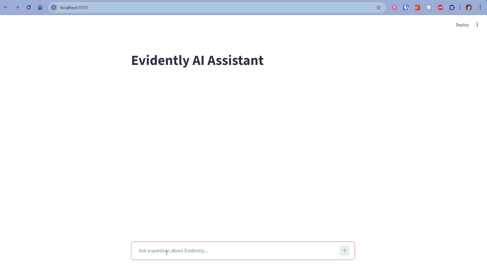

# Evidently AI Assistant

A RAG-powered AI agent that answers questions about the [Evidently](https://github.com/evidentlyai/evidently) library by searching its official documentation.

`Python` `OpenAI` `ChromaDB` `Streamlit` `Pydantic AI` `Sentence Transformers`



## Overview

Navigating large documentation repositories is time-consuming. This project automates the process by building an end-to-end RAG (Retrieval-Augmented Generation) pipeline that:

1. **Ingests** markdown files from any GitHub repository
2. **Chunks** documents using a sliding window approach
3. **Embeds** chunks with a sentence-transformer model
4. **Indexes** embeddings in a persistent ChromaDB vector store
5. **Serves** a Streamlit chat interface where an AI agent answers questions with source citations

The system includes a full **evaluation pipeline** that generates a golden Q&A dataset and scores agent responses using an LLM-as-judge approach.

## Project Structure

```
project/
  src/
    config.py               # Centralized configuration (paths, models, constants)
    ingest.py               # GitHub download + chunking + embedding + ChromaDB storage
    search.py               # Vector search over persisted ChromaDB collection
    agent.py                # Pydantic AI agent with search tool and interaction logging
    app.py                  # Streamlit chat interface
    generate_questions.py   # Generates ~20 golden Q&A pairs from indexed content
    evaluate.py             # Runs RAG agent on golden dataset, scores with LLM-as-judge
  data/                     # Runtime artifacts (gitignored)
    chromadb/               # Persisted vector store
    logs/                   # Agent interaction logs
    golden_questions.json   # Generated evaluation questions
    eval_results.json       # Evaluation results with scores

course/
  experiments.ipynb         # Jupyter notebook with day-by-day experiments
  instructions/             # Course lesson PDFs (Days 1-7)
```

## Installation

### Prerequisites

- Python 3.11+
- [uv](https://docs.astral.sh/uv/) package manager
- OpenAI API key

### Setup

```bash
# Clone the repository
git clone https://github.com/joaomelga/aihero-jm.git
cd aihero-jm

# Install dependencies
uv sync

# Configure your API key
echo "OPENAI_API_KEY=your-key-here" > project/.env
```

## Usage

All commands are run from the `project/` directory using `uv run`:

```bash
cd project
```

### 1. Ingest and index documentation

Downloads markdown files from the configured GitHub repository, chunks them, generates embeddings, and stores everything in ChromaDB.

```bash
uv run python -m src.ingest
```

### 2. Launch the chat application

Opens a Streamlit web interface where you can ask questions about Evidently.

```bash
uv run streamlit run src/app.py
```

### 3. Generate evaluation questions

Uses an LLM to generate ~20 Q&A pairs from the indexed content and saves them to `data/golden_questions.json`.

```bash
uv run python -m src.generate_questions
```

### 4. Run evaluation

Runs the RAG agent on each golden question, then scores each response using an LLM-as-judge. Results are saved to `data/eval_results.json`.

```bash
uv run python -m src.evaluate
```

## Features

- **Automated ingestion** from any public GitHub repository (configurable via environment variables)
- **Sliding window chunking** with configurable size and overlap
- **Persistent vector storage** using ChromaDB (survives restarts, no re-indexing needed)
- **Semantic search** powered by `multi-qa-distilbert-cos-v1` embeddings (768 dimensions)
- **AI agent** with tool use via Pydantic AI, including source citations with GitHub links
- **Interaction logging** for every agent conversation (JSON files with full message history)
- **Golden dataset generation** for systematic evaluation
- **LLM-as-judge evaluation** with a 7-point checklist

## Evaluation

The evaluation pipeline tests the agent's quality using a two-step process:

1. **Question generation** (`generate_questions.py`): An LLM reads a sample of indexed documentation chunks and produces ~20 diverse Q&A pairs covering different topics
2. **Scoring** (`evaluate.py`): For each question, the RAG agent generates an answer, then a separate LLM judge evaluates it against a 7-point checklist:

| Check | What it measures |
|---|---|
| `instructions_follow` | Agent followed its system prompt |
| `instructions_avoid` | Agent avoided doing things it was told not to do |
| `answer_relevant` | Response directly addresses the question |
| `answer_clear` | Answer is clear and correct |
| `answer_citations` | Proper citations/sources are included |
| `completeness` | Response covers all key aspects |
| `tool_call_search` | Search tool was invoked |

**Latest results**: Results: 13/21 questions passed all checks (61.9%)

## Tech Stack

| Technology | Role |
|---|---|
| [Pydantic AI](https://ai.pydantic.dev/) | Agent framework with tool use and structured output |
| [OpenAI GPT-4o-mini](https://platform.openai.com/) | LLM for the RAG agent |
| [OpenAI GPT-5-nano](https://platform.openai.com/) | LLM for evaluation (judge) and question generation |
| [ChromaDB](https://www.trychroma.com/) | Persistent vector database |
| [Sentence Transformers](https://www.sbert.net/) | Embedding model (`multi-qa-distilbert-cos-v1`) |
| [Streamlit](https://streamlit.io/) | Web chat interface |
| [uv](https://docs.astral.sh/uv/) | Python package and project manager |
